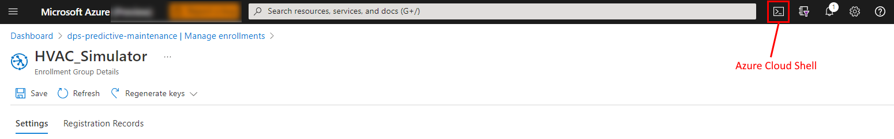

# Configuration

## Create a Azure DPS enrolment group

1. From your browser, navigate to the [Azure Portal](https://portal.azure.com).
1. Select the Azure DPS resource created for the Predictive Maintenance solution.
1. Select **Manage enrollments**.
1. Select **Add enrollment group**.
1. Name the group `HVAC_Simulator`.
1. Select **Symmetric key** for the **Authentication type**.
1. Select **Save**.
1. Don't close the browser window, you will need the enrollment group **Primary key** in the next step.

## Create an Azure DPS derived device key

1. Select the newly created **HVAC_Simulator** enrollment group.
1. Copy the **Primary key** to the clipboard.
1. Select the Cloud Shell button in the Azure Portal to open a command-line window in the browser.
    
1. Run the following command in the cloud shell to create a derived device key:

    ```bash
    az iot dps enrollment-group compute-device-key --rid hvac_simulator --key <your-primary-key> 
    ```

1. Copy the derived device key to the clipboard and save it somewhere safe as you will need this data when you start the HVAC simulator app.

## Create an Open Weather Map API key

Open Weather Map is a weather data provider. The HVAC simulator app uses Open Weather Map to get the current weather conditions. You must create a **free** Open Weather Map API key to use the app.

Follow these steps to create a free Open Weather Map API key:

1. From your web browser navigate to [https://openweathermap.org/api](https://openweathermap.org/api)
1. Sign in to Open Weather Map
1. Select **API** from the Open Weather Map main menu.
1. Subscribe to the Current Weather Data. Select the **Free** option, and select **Get API key**.
1. Repeat and subscribe to the Air Pollution API. Select the **Free** option, and select **Get API key**.
1. Select **API Keys** from the Open Weather Map site.
1. Copy the Open Weather Map API key and save it somewhere safe as you will need this data when you start the HVAC simulator app.

## Update the HVAC simulator app configuration

1. Open the Publish/prebuilt/.env file with your favorite text editor and update the following keys values.
    - **DEVICE_ID**
    - **DERIVED_KEY**
    - **OWM_KEY**
1. Save the file.
