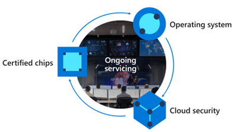
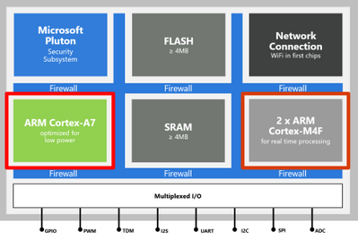
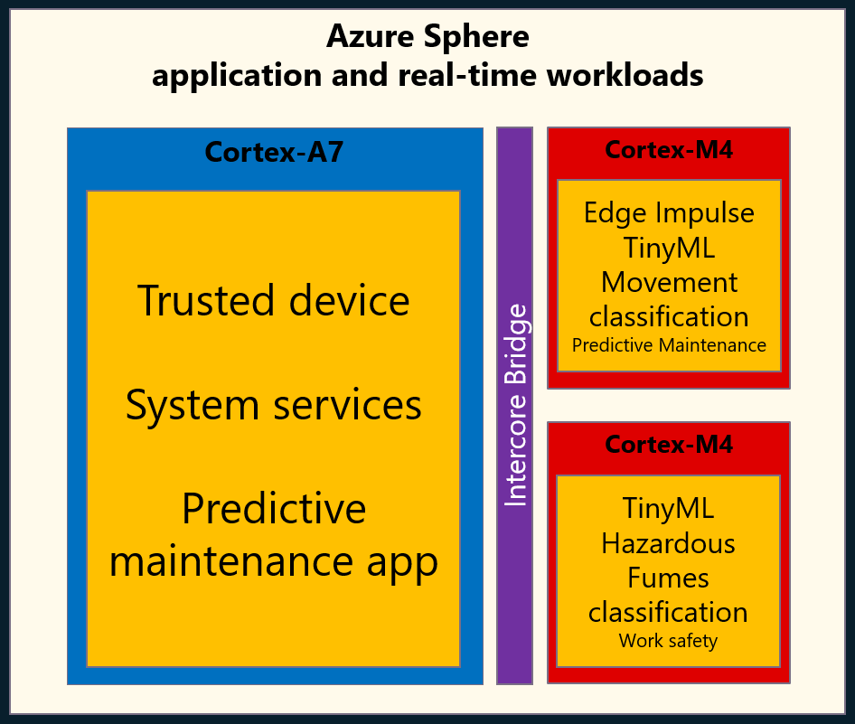

# Introduction

## ML on embedded hardware

AI-powered predictive maintenance can help identify a faulty machine before a real problem occurs, reducing maintenance costs, improving availability and customer satisfaction. The advantages of predictive maintenance include:

- Reduced carbon footprint. Keeping equipment running well has straightforward benefits for operating efficiency, but we should also ensure our processes are efficient. Fault monitoring can generate high volumes of low-value data. Sending this data to cloud systems consumes power and network resources. Running an ML model on embedded hardware consumes less electricity and network resources. Only predicted maintenance events get sent to the backend systems. Disabling network interfaces (for example, Wi-Fi) can further reduce power consumption until a high-value predictive maintenance event occurs.
- Access to better data for faster fault resolution.
- Low latency response to system faults. There are fault monitoring use cases that require immediate action to shut down a system. Sending fault monitoring data to cloud systems for processing might be too slow, further damaging the machine.

## Predictive maintenance on Azure Sphere

Azure Sphere is a secure embedded platform that is ideal for quickly developing an IoT system. By providing a platform meeting all 7 properties of highly secured devices, Azure Sphere eliminates the need to be a hardware, OS, and security expert. These seven properties make Azure Sphere ideal for running and updating ML models. You don’t want to solve one problem (equipment operation) and introduce a larger one (security).

You can deploy up to 3 custom apps on Azure Sphere, including two ML workloads on the low-power real-time cores. The predictive maintenance solution runs a continuous movement classification TinyML model on one of the Azure Sphere real-time cores. When the TinyML model detects movement, for example, a rattle, or a faulty motor bearing, an event is sent to the predictive maintenance app running on the high-level core. The predictive maintenance app then powers up the network connection and sends the event to Azure IoT Central. Azure IoT Central exports the predictive maintenance event to a Logic App, which generates a message destined for Microsoft Teams.

The beauty of this solution is that you are combining building blocks. You don’t need to be a security expert, Azure Sphere has got you covered, Edge Impulse simplifies model development, and IoT Central, Logic Apps, Microsoft Teams are low code offerings making it easier to pull everything together.

## Azure Sphere

The traditional approach to IoT microcontroller development is that you are responsible for integrating and maintaining all the bits of a solution. This includes the communications stack, security, authentication, certificates, identity, encryption libraries, update processes, your solution and more. Not only are you a solution domain expert, but you are now responsible for tracking new and emerging security threats, mitigating, and updating to protect IoT devices.

Azure Sphere is a unique highly secure IoT platform. You focus on your solution, Azure Sphere deals with security, identity, certificates, reporting, tracking emerging attack vectors, mitigating, updating the platform, and application distribution to protect your solutions, customers, and reputations.

Azure Sphere consists of the following components:

- **Azure Sphere–certified chips** from hardware partners include built-in Microsoft security technology to provide connectivity and a dependable hardware root of trust.
- **Azure Sphere OS** adds layers of protection and ongoing security updates to create a trustworthy platform for new IoT experiences.
- **Azure Sphere Security Service** brokers trust for device-to-cloud communication, detects threats, and renews device security.
Together these components implement The Seven Properties of Highly Secure Devices .

## Azure Sphere MediaTek MT3620 MCU architecture

The first Azure Sphere certified MCU is the MediaTek MT3620 microcontroller unit (MCU). This MCU which has three developer-accessible cores, a Cortex-A7 that runs a hardened Linux kernel, and two Cortex-M4 cores.

- The Cortex-A7 core runs less timing-sensitive tasks such as setting up network connections, negotiating security, refreshing certificates, updating the device OS and applications. You can run a custom application on this core and send and receive messages to predefined network endpoints including cloud gateways such as Azure IoT Hub.
- On the Cortex M4 cores you can run bare-metal code, or applications running on a real-time operating system such as Azure RTOS or FreeRTOS.

## Predictive maintenance solution architecture

<!--  -->

### Solution architecture in detail

1. The TinyML *movement classification* model runs on one of the Azure Sphere's real-time cores.
    - Movement is classified using a TinyML (Tensorflow Lite) model. If a fault is detected, a message is sent to the predictive maintenance app running on the Azure Sphere high-level core.
    - The TinyML model was [trained using Edge Impulse](https://www.edgeimpulse.com/). The TinyML model was exported from Edge Impulse and included in the Azure Sphere real-time app for local machine learning inference.
1. The HVAC *predictive maintenance* app runs on the high-level A7 core.
    - The predictive maintenance app updates IoT Central when a fault is detected.
