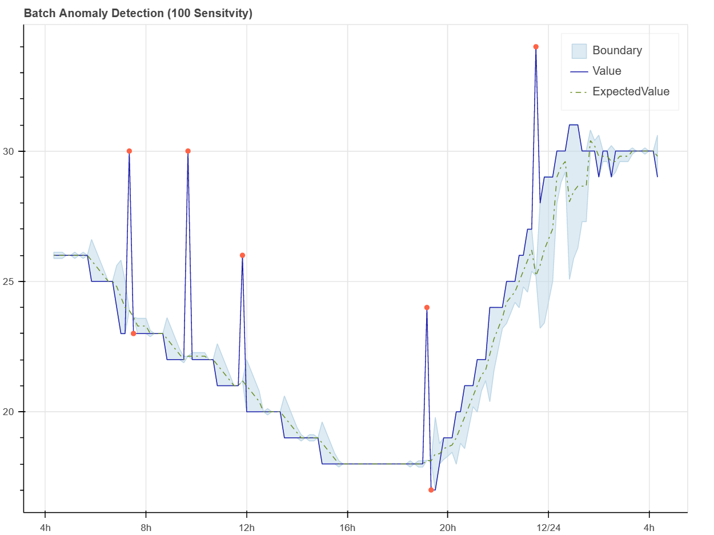

# Univariate anomaly detection

No model training is required for univariate anomaly detection.

Univariate anomaly detection detects anomalies in your data. Data can be sent to the anomaly detection API in one of two ways:

1. Batch inference - You can send a batch of data to the anomaly detection API and it will return the predicted anomalies for the data.
1. Streaming inference - You can send data to the anomaly detection API one data point at a time. The anomaly detection API will return the predicted anomaly for the data point.

You can find out more Azure Anomaly Detection from the [Azure Anomaly Detector](https://learn.microsoft.com/azure/cognitive-services/anomaly-detector/) documentation.

## Update the Notebook environment config file

Using your favorite text editor, open the file `Notebooks/.env` and update the following values using the values from the deployment output that you saved in the previous section.

- storage_connection_string=
- anomaly_detector_endpoint=
- anomaly_detector_key=
- inference_telemetry_endpoint_url=
- inference_telemetry_endpoint_key=

## Start the Jupyter Notebook server

1. Navigate to the `Notebooks` folder.
1. Start the Jupyter Notebook server by running the following command:

    ```bash
    jupyter notebook
    ```

1. A browser window will open and display the Jupyter Notebook dashboard. Click on the `univariant_sql_inference.ipynb` notebook to open it.
1. Run the notebook cells one at a time. The notebook will walk you through the process of loading the data, training the model, and detecting anomalies.

The notebook will show a plot of the predicted anomalies. The plot will show the predicted anomalies as red dots. The red circles are the actual anomalies that were generated by the HVAC simulator app. The red dots are the predicted anomalies generated by the anomaly detection model.


