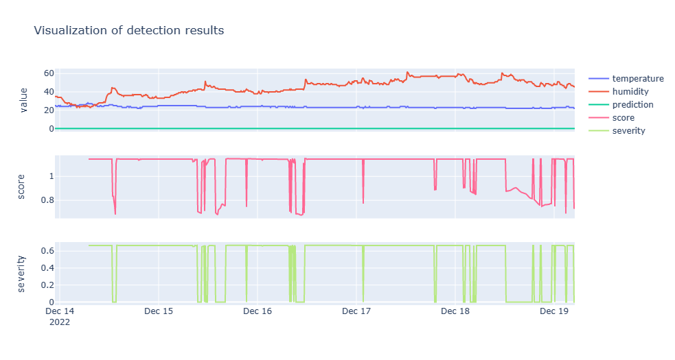

# Multivariate anomaly detection

Multivariate anomaly takes a holistic approach to anomaly detection. It uses all the variables in the training dataset to train the model. This is different from univariate anomaly detection, which uses only one variable and doesn't require a pre-trained model.

To use multivariate anomaly detection, you must training a model using multivariate data. You can use the data generator to generate multivariate data or you can also use your own data.

Multivariate anomaly detection inference is similar to univariate anomaly detection inference. You can use the anomaly detection API to detect anomalies in your data. Data can be sent to the anomaly detection API in one of two ways:

1. Batch inference - You can send a batch of data to the anomaly detection API and it will return the predicted anomalies for the data.
1. Streaming inference - You can send data to the anomaly detection API one data point at a time. The anomaly detection API will return the predicted anomaly for the data point.

You can find out more Azure Anomaly Detection from the [Azure Anomaly Detector](https://learn.microsoft.com/azure/cognitive-services/anomaly-detector/) documentation.

## Create training dataset

You need to create a training dataset that contains the multivariate data that you want to use to train the model. The training dataset consists of the following columns:

- `timestamp` - The timestamp of the data point.
- temperature - The temperature of the data point.
- humidity - The humidity of the data point.
- predicted - The predicted anomaly of the data point.

You need around 15000 data points to train the model. Given it's unlikely that you have that much data in your database, you can use a data generator to synthetically generate the data.

## Generate the training dataset

In the **Notebooks/DemoMultivariateTraining** folder there is a Python generator that you can use to generate the training data. The generator will generate a CSV file that you can use to train the model. To run the generator, follow these steps:

1. From a command line, navigate to the **Notebooks/DemoMultivariateTraining** folder.
1. Run the following command.

    ```bash
    python3 generator.py
    ```

This will generate a CSV file in the **Notebooks/DemoMultivariateTraining/training** folder. The CSV file will be named `sensors.csv`.

## Train an Anomaly Detection multivariate model

1. Navigate to the **Notebooks** folder.
1. Start the Jupyter Notebook server by running the following command:

    ```bash
    jupyter notebook
    ```

1. Open the **DemoMultivariateTraining/multivariate_train_from_timeseries_data.ipynb** notebook.
1. Run all the cells in the notebook.
1. You'll notice the **Train a model** cell will take a while to run. This is because it's training the model using the data that you generated in the previous step. The training process will take a few minutes to complete. When the training process is complete. The output for this cell will be similar to the following:

    ```text
    // highlight-start
    model id: 9990b402-8041-11ed-b12c-f2dc2fbc265b
    // highlight-end
    model status: CREATED
    model status: RUNNING
    model status: READY
    ```

1. Make a note of the model id as you must update the **Notebooks/.env** file with this model id.

## Detect anomalies using the multivariate model

1. Navigate to the `Notebooks` folder.
1. Start the Jupyter Notebook server by running the following command:

    ```bash
    jupyter notebook
    ```

1. A browser window will open and display the Jupyter Notebook dashboard. Click on the `multivariate_sql_inference_plot.ipynb` notebook to open it.
1. Run the notebook cells one at a time. The notebook will walk you through the process of loading the data, training the model, and detecting anomalies.

The notebook will show a plot of the predicted anomalies. The plot will show the predicted anomalies as red dots. The red circles are the actual anomalies that were generated by the HVAC simulator app. The red dots are the predicted anomalies generated by the anomaly detection model.


