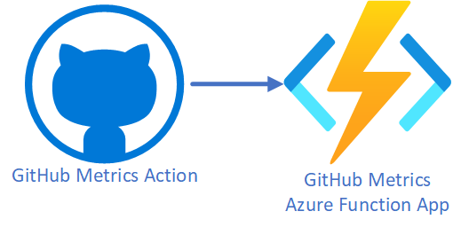

# Introduction

GitHub metrics are collected by a GitHub action triggered by a scheduled event. The GitHub action collects metrics from the GitHub API and posts the metrics to an Azure Function App webhook. The Azure Function App webhook is a secure endpoint that accepts the metrics payload and stores the metrics in a database.

In this section, you will learn how to:

1. Create a [fine-grained GitHub Personal Access Token](https://github.blog/2022-10-18-introducing-fine-grained-personal-access-tokens-for-github) (PAT).
1. Upload GitHub secrets with the GitHub CLI.
1. Add a GitHub action.

<!-- The instructions below assume you are tracking GitHub metrics for repos in your personal GitHub account.

To track GitHub metrics for repos in a GitHub organization, then refer to [GitHub organization repos](#github-organization-repos) for information on creating a Personal Access Token for an organization. -->
