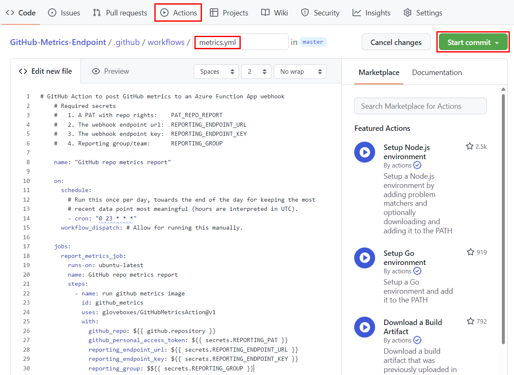
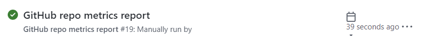

# Add a GitHub Action

Follow these steps to create a GitHub Action that collects metrics from the GitHub API and posts the metrics to the metrics tracker Azure Function App webhook.

1. Navigate to the GitHub repo that you want to track metrics for.
1. Select **Actions** from the repo menu.
1. Select **New workflow**.
1. Select **Set up a workflow yourself**.
1. Name the workflow **metrics.yml**.
1. Copy the following code into the editor.

    ```yml
    # GitHub Action to post GitHub metrics to an Azure Function App webhook
    # Required secrets
    #   1. A PAT with repo rights:    PAT_REPO_REPORT
    #   2. The webhook endpoint url:  REPORTING_ENDPOINT_URL
    #   3. The webhook endpoint key:  REPORTING_ENDPOINT_KEY
    #   4. Reporting group/team:      REPORTING_GROUP

    name: "GitHub repo metrics report"

    on:
      schedule:
        # Run this once per day, towards the end of the day for keeping the most
        # recent data point most meaningful (hours are interpreted in UTC).
        - cron: "0 23 * * *"
      workflow_dispatch: # Allow for running this manually.

    jobs:
      report_metrics_job:
        runs-on: ubuntu-latest
        name: GitHub repo metrics report
        steps:
          - name: run github metrics image
            id: github_metrics
            uses: gloveboxes/GitHubMetricsAction@v1
            with:
              github_repo: ${{ github.repository }}
              github_personal_access_token: ${{ secrets.REPORTING_PAT }}
              reporting_endpoint_url: ${{ secrets.REPORTING_ENDPOINT_URL }}
              reporting_endpoint_key: ${{ secrets.REPORTING_ENDPOINT_KEY }}
              reporting_group: $${{ secrets.REPORTING_GROUP }}
    ```

1. Select **Start commit**.
1. Select **Commit new file**.

    

## Test the GitHub Action

1. Select **Actions** from the repo menu.
1. From the Actions menu, select **GitHub repo metrics report**.
1. Select **Run workflow**, then select **Run workflow** again.
1. Check that the workflow completes successfully. The GitHub Action will show a green checkmark if the workflow completes successfully.

    
