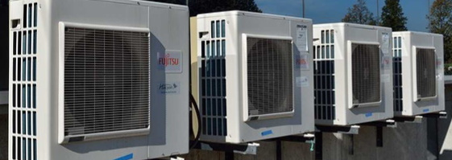

# Introduction

Anomaly detection is a technique that uses data analytics to identify unusual patterns in data. For example, you can analysis business metrics to detect unusual patterns that indicate a problem with your business, or look at sensor data to detect unusual patterns that indicate a problem with a machine.

This workshop focuses on using [Azure Anomaly Detector](https://azure.microsoft.com/products/cognitive-services/anomaly-detector) for predictive maintenance. Predictive maintenance is a technique that uses data analytics to predict when a machine is likely to fail. This allows maintenance to be scheduled before the failure occurs, reducing downtime and increasing productivity.

This solution is themed around an [HVAC](https://en.wikipedia.org/wiki/Heating,_ventilation,_and_air_conditioning) system, because it is a common use case for predictive maintenance. HVAC systems are found in our homes, offices, and factories. The solution uses environment and vibration data to predict when a machine is likely to fail.

The solution supports two scenarios:

1. A simulated HVAC app that collects environment data from Open Weather Map and generates vibration prediction data and sends the data to Azure IoT Hub. The simulated HVAC app runs on Windows, macOS, or Linux.

    

1. An Avnet [Azure Sphere](https://azure.microsoft.com/products/azure-sphere) device that collects environment data from the built-in sensors and runs a ML model to classify vibrations and sends the data to Azure IoT Hub. This scenario requires an Avnet Azure Sphere device.

    

## Solution Architecture

The following image shows the solution architecture.

1. The HVAC simulator app or Azure Sphere device collects environment and vibration data and sends the data to Azure IoT Hub.
1. An Azure Function processes the data sent to Azure IoT Hub and stores it in Azure SQL.
1. The data is analyzed with a Jupyter Notebook and Azure Anomaly Detector to predict when a machine is likely to fail.

